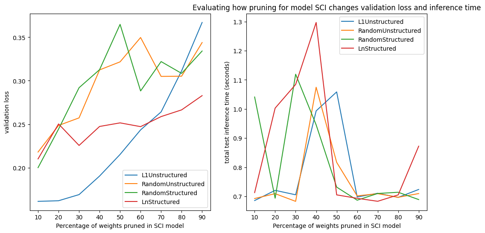
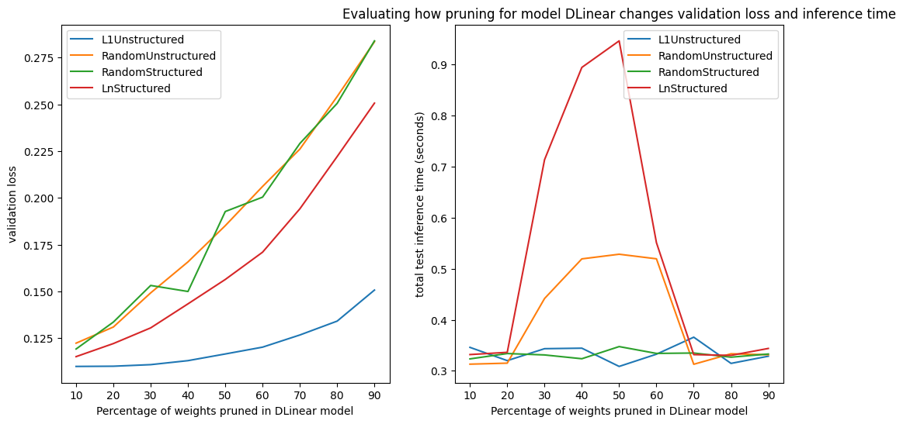
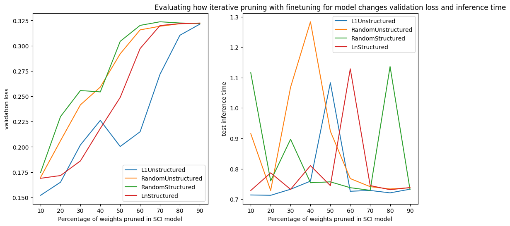
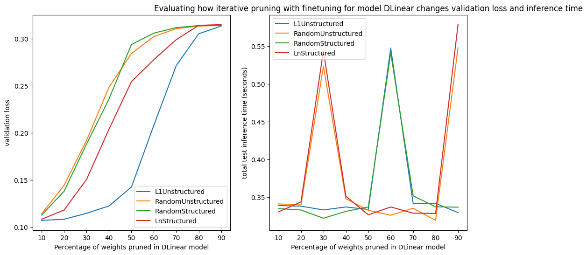

## Comparing the Effectiveness of Convolutional Layers in Long Term Time Series Forecasting

### Introduction

This paper examines the performance of two models, SCINet and DLinear, applied to two time series data sets for high performance machine learning. The data sets used in the study are the electricity transformer temperature dataset. Time series forecasting is a critical task in various domains, including energy and finance, where accurate predictions can lead to significant benefits. The paper presents a detailed description of the models and data sets used in the study, the training and profiling methodology, the performance tuning methodology, and the experimental results. The experimental results demonstrate the effectiveness of both models on the time series data sets, with DLinear outperforming SCINet on certain metrics. Overall, this paper provides valuable insights into the performance of convolution-based and linear models on time series data sets and their potential applications in high performance machine learning.

### Dataset

The ETT (Electricity Transformer Temperature) [data set](https://github.com/zhouhaoyi/ETDataset) is a vital metric in long-term electric power deployment, consisting of two years of data from two counties in China. The data set offers two granularity levels for examination: hour ticks (ETTh1) and minute ticks (ETTm1). Each data point in the hourly subset (ETTh1) includes the target variable "oil temperature" and six power load features. For this paper, we will be using the hourly ETTh1 data. This dataset serves as a common benchmark for testing SOTA models in the field of Long Term Time Series Forecasting (LTS). We also referenced code from [Informer](https://github.com/zhouhaoyi/Informer2020) model for the DataLoaders for ETTh data.

### Repo Organization & Running the Code

We organized all code into a single Colab notebook which can be found here [notebook](https://colab.research.google.com/drive/1CbW_ecoqsgGxuSBfY8MlouSrE7_YrM5M#scrollTo=L7uKJbrCq630). The data used for this project can be found at `data/ETTh1.csv`. 

To run this Colab notebook

* first save a local copy of the notebook in Drive
* upload the dataset to Drive
* give authorization to access Drive as prompted

A walkthrough of the code sections

* `SCINet Model Definition` and `DLinear Model Definition`
  * contains the buildings blocks for the SCINet model and DLinear model, referencing code from [SCINet](https://github.com/cure-lab/SCINet) and [DLinear](https://github.com/cure-lab/LTSF-Linear) GitHub repos.
* `DataLoading and Preprocessing`
  * defines custom dataloader / parser for ETTh dataset
  * defines utilities for loading / saving models
* `Experiment`
  * `Training Definition`
    * defines training loop and hyperparameters
  * `Hyperparameter Sweep`
    * defines hyperparameter sweep with Weights & Biases. Notice the appeal of the DLinear model is that it generalizes well without hyperparameters tune (Except for batchsize and learning rate, which can be empirically set)
  * `PyTorch Profiling`
    * profiles CPU and GPU activity for both models for 20 iterations in training mode and inference mode
  * `Pruning`
    * defines model pruning for CPU

### Results & Conclusions

#### Preliminary Training

A preliminary training with default hyper parameters are run for both models with the results exported to the folder `/training_loop`. For SCINet the average training iteration before tuning is `0.096 s/iter`, and the average inference before tuning is `0.035 s/iter`. For DLinear due to its simple structure (one single linear layer per data point) the training and inference iteration are a lot faster, averaging respectively at `0.054 s/iter` and `0.0169/iter`. Surprisingly, the simple linear model outperforms SCINet in terms of MSE loss, yielding final results `Train Loss: 0.1665928 valid Loss: 0.1092133 Test Loss: 0.0748877` whereas SCINet is at `Train Loss: 0.2309196 valid Loss: 0.1293330 Test Loss: 0.0913697` . This counterintuive result will be further explained in our presentation.

#### Hyperparameter Tuning

We ran hyperparameter tuning for SCINet using Weights & Biases. We made the result available at [this link](https://wandb.ai/zifan/SCINet/sweeps/zduo6z7b?workspace=user-zifanwangsteven).  The set of hyperparameters we tuned for are as follows

```json
{
    'lr': {
        'values': [0.0001, 0.00025, 0.0005, 0.001]
        },
    'dropout': {
        'values': [0, 0.3, 0.5, 0.7]
    },
    'hidden_size': { # hidden size in convulution 
        'values': [1, 2, 3]
    },
    'kernel': { # kernel size for convulution
        'values': [3, 5, 7]
    },
    'window_size': { # lookback window
        'values': [8, 12, 14]
    },
    'stacks': { # number of SCINet Blocks to use
        'values': [1, 2]
    },
    'decoder_layers': {
        'values': [1, 2]
    },
    'levels': { # level of binary trees inside a SCINet Block
        'values': [2, 3, 4, 5]
    }
}
```

According the Weights & Biases run, the most important factor is `stacks` where multiple stacks of SCINet tend to yield worse performance because of overfitting. Other top factors include`lr`, `window_size` and `kernel`. The best performing sweep has the combination `decode_layers=2, dropout=0, hidden_size=1, kernel=5, levels=3, lr=0.0005, stacks=1, window_size=12` and yields a better training loss of `0.132`

#### Profiling

Pytorch profiler was run for 20 iterations for each model (once for training loop, once for inference). The respective results are shown in the folder `profiling`. 

The top operations for each case are respectively:


Further interpretations of the results will be discussed in the presentation.

#### Pruning
In the pruning section, we attempted to prune each of the models, SCINet and DLinear. We approach the pruning problem by using both global pruning techniques and iterated pruning with finetuning. We used four different pruning methods: L_1 Unstructured, Random Structured, Random Unstructured, and L_n Structured with n=2 (effectively using the L_2 norm). The results are presented below for pruning and demonstrate how validation loss increases as we prune away more of the parameters of the models (as expected). We also plot the inference times on the test dataset alongside validation loss. Surprisingly, there is no clear trend evident in the inference times (increasing the pruning percentage in a  model's layer doesn't seem to directly lead to higher or lower inference times). 









Overall, the most remarkable results come from pruning the SCINet model using the L1 Unstructured pruning method with iterative pruning and finetuning. We were able to observe the best tradeoff between an increase in the validation loss and a decrease in overall model complexity when we pruned 50% of the total weights in each of the Conv1d layers of the SCINet model using the L1 unstructured pruning method. It seemed that pruning was less effective (and generally less needed) for the DLinear model due to the fact that DLinear is composed of a single linear layer whereas SCINet is a much more complex model. 

While the pruning reduced the overall model complexity from a space complexity perspective for both models, meaning that they required far less memory, the inference time for the newly pruned models occasionally increased or stayed constant as compared to the baseline model. Fortunately, both models are already quite fast, so the introduction of quantization was deemed unnecessary to further attempt to decrease model memory or increase model inference speed.

#### Conclusions
We were able to examine two state of the art models used for long sequence time series forecasting. We examined different hyperparameter configurations for the models and used profiling methods to examine the inference times of the models and look at performance bottlenecks. Finally, after deciding to focus on examining how we could deploy these models in a memory-constrained setting, we set out to prune their weights while preserving test accuracy as much as possible. After pruning, we were able to reduce the number of model weights for SCINet by as much as 50% while maintaining a validation error that remained close to the baseline error rate.

